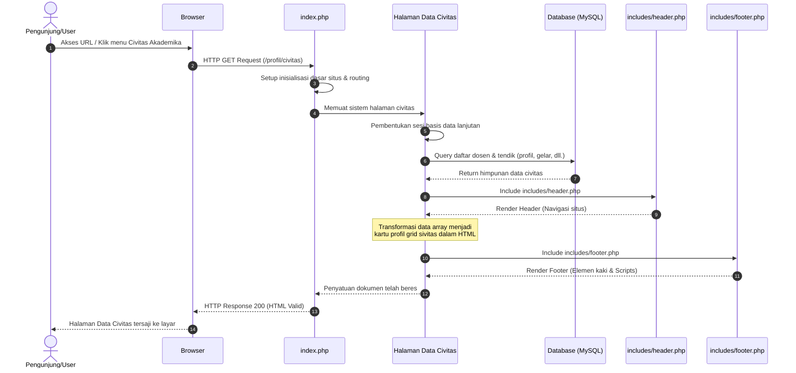

# Sequence Diagram: Halaman Data Civitas Akademika

Diagram sekuensial ini menjelaskan alur operasional di balik layar ketika pengguna melihat halaman informasi **Data Civitas Akademika** (seperti profil dosen maupun tenaga kependidikan).

## Penjelasan Alur

Alur komunikasi pada diagram sekuensial ini bermula tatkala pengguna mengeklik menu atau langsung mengarahkan tautan URL untuk mengakses halaman Data Civitas Akademika. Panggilan antarmuka tersebut ditangkap terlebih dahulu oleh tulang punggung aplikasi (`index.php`), yang berperan meretas rute agar sistem dapat memanggil skrip fungsional yang berkaitan dengan halaman data (*civitas*). Setelah skrip diinisiasi, sebuah sesi negosiasi kepada lapis *database* (MySQL) pun disiapkan supaya situs web dapat bertukar informasi dengan aman.

Melalui saluran penghubung basis data inilah, halaman Data Civitas secara aktif menghantarkan sekumpulan instruksi kueri untuk membentangkan profil para tenaga pengajar (dosen) berserta staf kependidikan yang terekam pada tabel sistem. Data rincian yang antara lain memuat potret jabatan dan latar belakang akademik tersebut lantas direkam sejenak di sisi *server*. Tak lama setelahnya, kerangka visual atas navigasi halaman (`includes/header.php`) diproses. Sistem merakit profil tiap-tiap entitas sivitas ini dalam tata letak yang berkesinambungan layaknya sebuah presentasi balok matriks (HTML *grid* statis), menyelaraskannya dengan blok ujung (`includes/footer.php`), hingga terbentuk sebuah keluaran tanggapan kode respons (HTML) yang dikirim dan dicetak ke peramban pengguna.

## Diagram

