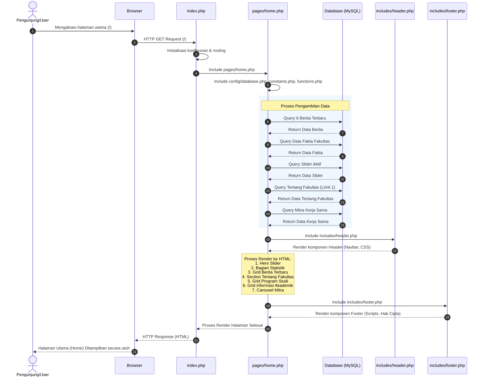

# Sequence Diagram: Halaman Utama (Home)

Diagram sekuensial ini menggambarkan alur kerja sistem ketika seorang pengunjung mengakses halaman utama (beranda/home) dari Web FIKOM.

## Penjelasan Alur

Secara garis besar, proses interaksi pada Halaman Utama dimulai ketika pengguna mengakses antarmuka penelusuran utama (*root URL*) melalui peramban web mereka. Permintaan awal tersebut segera diterima oleh sistem peladen utama (`index.php`) yang bertugas sebagai pengendali rute (*router*). Sistem ini selanjutnya akan mengarahkan dan memuat modul khusus untuk halaman beranda. Pada tahapan persiapan ini, halaman beranda (`pages/home.php`) akan terlebih dahulu memuat seluruh konfigurasi dasar, fungsi pelengkap, serta memulai sesi koneksi yang aman menuju pangkalan data fakultas (*database* MySQL).

Setelah simpul koneksi pangkalan data tersambung, sistem akan melanjutkan instruksi dengan melakukan serangkaian operasi pengambilan data secara komprehensif. Operasi penarikan ini mencakup pengambilan 6 (enam) rilis berita paling baru, pencatatan statistik dan fakta kampus, pemanggilan daftar media gambar untuk panel tata letak sorotan (*hero slider*) yang sedang berstatus aktif, hingga pencarian rincian singkatan profil fakultas dan rekaman entitas mitra kerja sama. Seluruh data mentah yang sukses diperingkas oleh *database* ini selanjutnya diracik untuk melengkapi komponen visual kerangka struktural web. Sistem akan mendirikan batas atas antarmuka (*header*) serta merangkai balok-balok informasi utama ke dalam *grid*, sebelum akhirnya menyudahi rangkuman halaman tersebut dengan pemuatan seksi penutup (*footer*) dan berkas interaktif JavaScript yang relevan. Pada ujung jalurnya, sistem melepas kompilasi struktur final dalam bentuk respons HTML penuh yang kemudian dibentangkan dengan tuntas pada layar pengguna.

## Diagram

