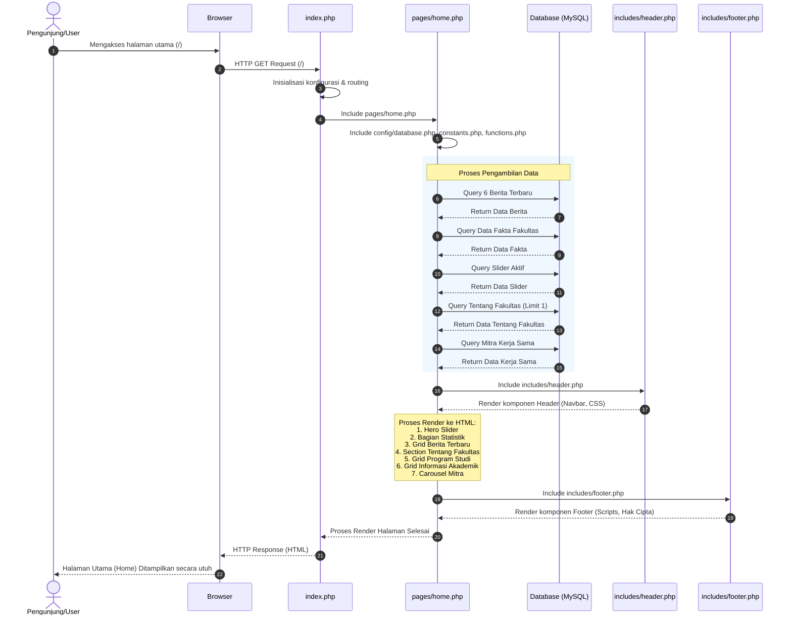

# Sequence Diagram: Halaman Utama (Home)

Diagram sekuensial ini menggambarkan alur kerja sistem ketika seorang pengunjung mengakses halaman utama (beranda/home) dari Web FIKOM.

## Penjelasan Alur

1. **Pengguna Mengakses Halaman**: Pengguna mengakses *root url* (`/`) melalui browser.
2. **Routing oleh `index.php`**: Permintaan diterima oleh `index.php` yang mengatur *routing* dasar dan memutuskan untuk memuat file `pages/home.php`.
3. **Persiapan Halaman & Koneksi**: `pages/home.php` memuat file konfigurasi, fungsi, dan koneksi ke *database*.
4. **Pengambilan Data (Query)**:
   - **Berita**: Mengambil 6 berita terbaru (`LIMIT 6`, diurutkan berdasarkan `tanggal_publish`).
   - **Fakta**: Mengambil seluruh fakta statistik fakultas.
   - **Slider**: Mengambil semua gambar *hero slider* yang berstatus aktif (`is_active = 1`).
   - **Tentang Fakultas**: Mengambil data deskripsi dan gambar tentang fakultas.
   - **Mitra Kerja Sama**: Mengambil iterasi logo dan data instansi kerja sama untuk menampilkannya ke dalam fitur *auto-scroll carousel*.
5. **Render Header**: Sistem memuat dan me-*render* tampilan awal atas halaman yang mencakup navigasi melalui komponen `includes/header.php`.
6. **Render Konten Utama**: Sistem mencetak kerangka konten dengan menyematkan data yang telah diambil sebelumnya: *Hero Slider*, Statistik Fakta, *Grid* Berita Terbaru, Bagian Profil / Tentang Fakultas, *Grid* Program Studi, dan *Grid* Informasi Akademik.
7. **Render Footer**: Tampilan bagian bawah (termasuk *scripts* interaktif) dimuat dari `includes/footer.php`.
8. **Respon ke Pengguna**: Seluruh proses *rendering* HTML dikembalikan ke browser dengan respons sukses (200 OK) untuk ditampilkan kepada pengguna.

## Diagram

