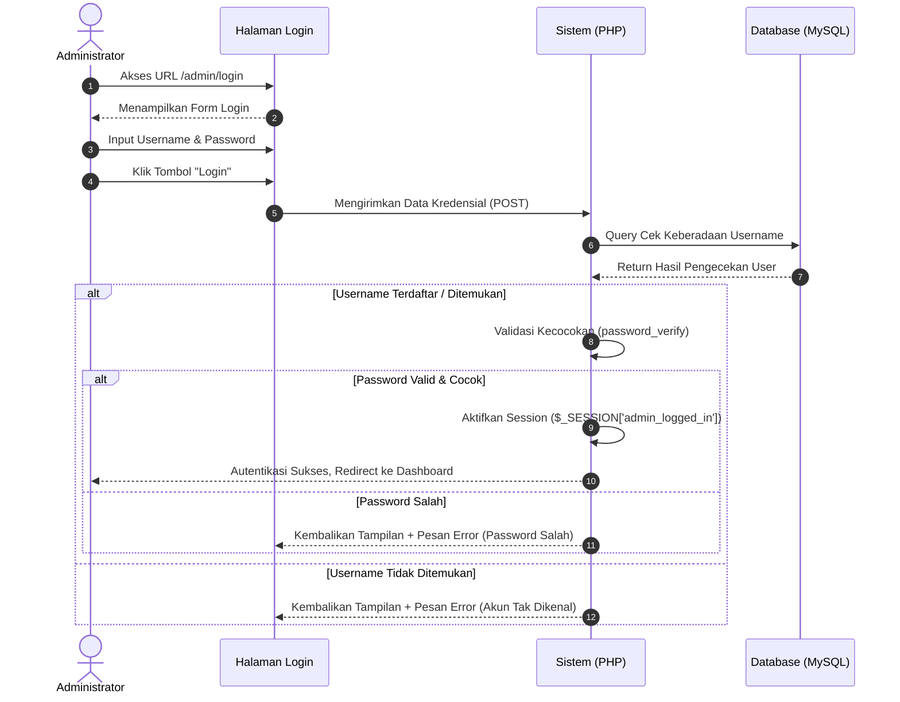

# Sequence Diagram: Halaman Login Admin

Diagram sekuensial ini memvisualisasikan alur sistem yang krusial pada saat seorang administrator melakukan autentikasi ke dalam tata kelola *backend* Web FIKOM.

## Penjelasan Alur

Alur keamanan pada diagram sekuensial ini merinci proses autentikasi tatkala seorang administrator mencoba melangkah masuk ke dalam panel kendali sistem. Langkah ini diawali dengan kunjungan admin ke antarmuka halaman penelusuran masuk (*login*). Lewat perambannya, ia akan dihadapkan pada sebuah formulir otorisasi pelindung tempat admin diwajibkan untuk mengisikan kombinasi nama pengguna (*username*) beserta sandi rahasianya (*password*). Begitu tombol pengajuan ditekan, antarmuka klien memaketkan kedua kredensial sensitif tersebut ke dalam bentuk lalu lintas serahan permintaan data (HTTP POST) yang selanjutnya dilontarkan secara aman menuju pos pemroses sistem skrip (PHP).

Sesampainya pada landasan peladen sistem, algoritma kendali (*backend*) segera merajut baris perintah (*query*) untuk menginterogasi tabel repositori *database* (MySQL). Tujuannya ialah untuk memverifikasi dan menelusuri apakah identitas *username* yang dikirimkan terdaftar di sistem. Apabila pangkalan data tidak berhasil menjumpai eksistensi *username* tersebut, maka sistem dengan sigap langsung mementalkan peramban agar kembali memuat halaman *login* terlepas dari apapun sandinya—kali ini disisipi dengan pemaparan pesan peringatan kegagalan akses.

Sebaliknya, perlakuan berbeda ditunjukkan manakala mesin berhasil menemukan kecocokan *username*. Alih-alih langsung membukakan celah gerbang, peladen justru akan menarik terlebih dahulu rekaman sandi tersandi (*password hash*) dari pangkalan data ke dalam memorinya. Sistem lantas menerapkan skema validasi bawaan kriptografis canggih (`password_verify`) demi menakar rasio kecocokan antara gembok di arsip tabel dengan kunci kata sandi yang diketik admin di awal tadi. Seandainya rasio itu meleset alias kata sandi keliru, pintu akses tetap tertutup rapat disusul rilis respons galat ke arah muka visual. Sebaliknya jika algoritma menjustifikasi validitas kata sandi itu dengan tuntas, administrator akan dianugerahi label legalitas dengan jalan menyematkan atribut hak penjelajahan (*session* `admin_logged_in`). Sebagai sentuhan pemungkas, peladen yang merampungkan tugas autentikasi ini memberikan pengarahan paksa otomatis (*redirect*) guna menjatuhkan posisi administrator melangkah masuk langsung ke dalam teras Dasbor pengelolaan web yang sesungguhnya.

## Diagram

