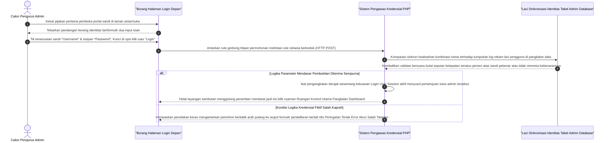

# Sequence Diagram: Login Administrator (Web FIKOM)

Diagram sekuensial ini menjelaskan alur operasional yang dikemudikan komputasi peladen manakala bertugas melayani pengguna yang mengetuk akses kendali pintu utama (Login).

## Penjelasan Alur

Rangkaian perlindungan pintu masuk modul login admin merintis alur interaksinya tatkala pengguna singgah pada bentangan rute halaman `/admin/login`. Saat pengunjung mengetuk palka pelataran ini, formulir isian mendasar menyerbak memfasilitasi dua pengangkut sandi rahasia: bilik isian *Username* bersanding pengetikan *Password*. Panel antarmuka tidak menyodorkan aksi lebih selain menuntut ketaatan mengisi kedua kompartemen ini dengan jalinan ketikan presisi identitas kredensial kepengurusan milik sang administrator.

Dalam perwujudan eksekusi keabsahan masuk, upaya komputasinya dititi lewat tindakan admin menancapkan kelengkapan kombinasi pautan akun dan sandi, dikunci bersama kepastian ketukan pada tuas tombol **"Login"**. Sentuhan pengunci permohonan membariskan paketan input untuk melompat merambah seberang dinding skrip pengolah gerbang di sisi *backend*. Skrip penengah secara kilat mendelegasikan perintah pertanyaaan besar kepada lumbung pangkalan penyimpanan data di tataran *MySQL*: mempertanyakan rincian sel data riwayat kepengurusan untuk mengecek kebenaran pengenalan dari identitas nama pengguna dan mencocokkan kemurnian keabsahannya atas untaian ketikan raga sandi yang dicecarkan pemohon akses.

Sebaliknya putusan penerimaan membeberkan realita konsekuensi mutlak. Andai sistem menyimpulkan komparasi paduan tersebut terpantau keliru maupun salah ketik secara tidak bertanggung jawab, rentetan gerbang peladen tanpa kelowongan akan melempar mental pemohon mundur keluar. Layar dengan telak memaparkan kembali formulir login asali tempat pengguna terhempas, dikepung semburat pesan peringatan kegagalan gertakan bahwa sandi yang dituduhkan tidak mendapati sandaran. Membalik logika terburuk itu, bilamana pengecekan kata rahasianya menyandang validitas status kepastian terpadu, instrumen *backend* tak segan membaptis ganjaran perizinan berupa pencetakan tiket bebas melenggang (Pengatribusian *Login Session Aktif* di ranah parameter pengelola pengunjung peramban). Dengan paspor persetujuan melintas berdaulat ini, rute pijakan administrator dilarutkan pindah menuju kemegahan rute (*redirects secara sah*) bersinggah menempati kokpit kekuasaan kendali peladen *Dashboard Ruang Master Pengendali* peranti sistem website seutuhnya.

## Diagram

