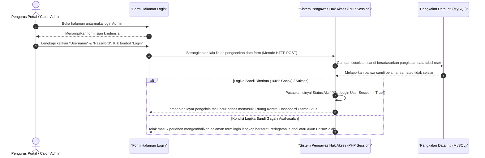

# Sequence Diagram: Login Administrator (Web FIKOM)

Diagram sekuensial ini menjelaskan secara praktis langkah-langkah yang dilalui ketika Admin akan masuk mengakses kendali (Login).

## Penjelasan Alur

Berikut rincian alur proses saat login admin dieksekusi:

1. **Mengunjungi Halaman Pintu Masuk**: 
   Awalnya, pengguna menapak pada `admin/login` untuk membuka formulir. Pintu panel sekadar menyediakan dua masukan: isian *Username* dan *Password*.

2. **Upaya Penyesuaian Sandi Layar**: 
   - Admin melengkapi data isian kredensial akun (*Username* bersanding *Password*), lantas mengeksekusinya di atas bingkai persetujuan tombol **"Login"**.
   - Input diserahkan mutlak pada skrip pos *backend*.
   - Kueri pemeriksaan sinkron dibangkitkan sistem kepada lapis memori *Database* MySQL untuk mengecek apakah kata sandinya cocok dan username dikenali.

3. **Deklarasi Penerimaan / Penolakan**:
   - Jika kombinasi Username atau Password salah, secara instan gerbang memantulkan peramban ke halaman yang sama. Halaman login menyajikan gertakan status peringatan bahwa "Password atau Akun salah".
   - Pengecualian telak didapat andai kata kecocokan sandi dibenarkan. Sistem membagikan identitas Kunci Sesi (*Session Key Login Aktif*) ke peramban. 
   - Pemandu diubah (mengalami *redirect*) agar admin dapat mendaratkan langkah suksesnya melenggang ke ruangan kendali peladen *Dashboard Utama* situs.

## Diagram

