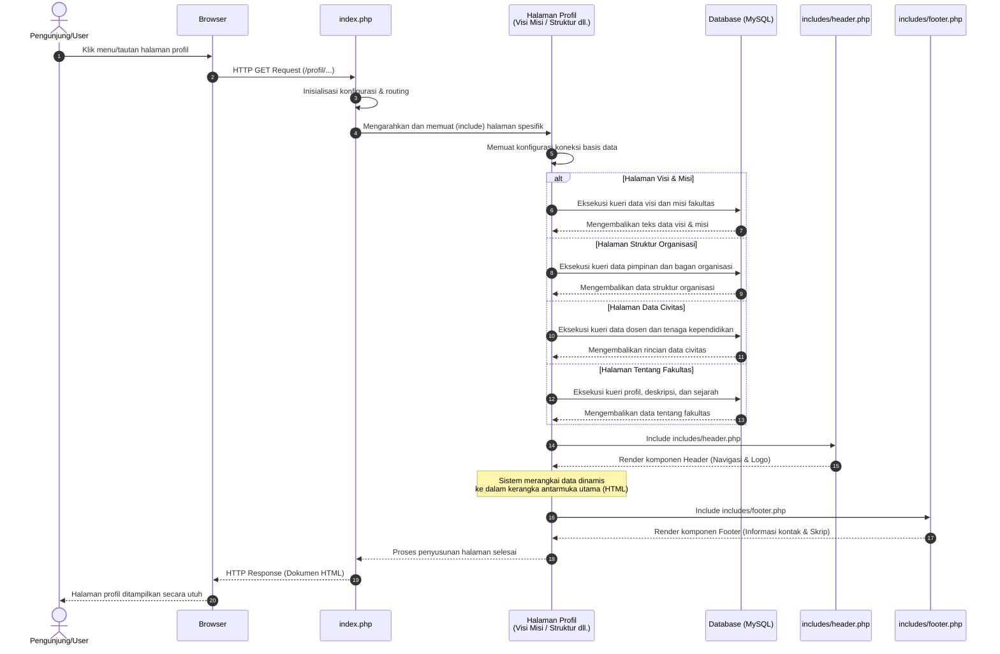

# Sequence Diagram: Halaman Profil dan Informasi Fakultas

Diagram sekuensial ini memvisualisasikan alur kerja interaksi sistem ketika pengguna (pengunjung) mengakses kelompok halaman profil fakultas, yang meliputi halaman **Visi dan Misi**, **Struktur Organisasi**, **Data Civitas Akademika**, serta **Tentang Fakultas**.

## Penjelasan Alur

Diagram sekuensial berikut menjabarkan alur interaksi sistem ketika seorang pengguna mengakses kelompok halaman profil fakultas. Pada tahap awal, pengunjung menginisiasi permintaan melalui peramban (browser) untuk membuka salah satu tautan halaman spesifik. Permintaan ini pertama kali diterima oleh berkas indeks utama yang berfungsi sebagai pengatur rute (*router*) dan pusat inisialisasi konfigurasi sistem. Berdasar pada rute yang diminta, berkas indeks kemudian memuat dan mengeksekusi berkas halaman spesifik (misalnya halaman visi dan misi, struktur organisasi, dan lain sebagainya). Setelah itu, berkas halaman tersebut akan membangun koneksi dengan basis data guna melakukan penarikan informasi yang paling relevan. Sistem secara dinamis akan mengeksekusi kueri yang berbeda secara spesifik bergantung pada halaman yang sedang dibuka; misalnya mengambil teks penjabaran visi dan misi, memuat rincian data pejabat untuk struktur organisasi, menarik daftar nama beserta jabatan untuk data civitas akademika, atau mengambil narasi profil dan sejarah untuk halaman tentang fakultas. Begitu data yang diperlukan berhasil diletakkan pada memori, sistem mulai menyusun antarmuka visual dengan memuat komponen navigasi atas (*header*), menyematkan data-data tersebut ke dalam kerangka tata letak konten utama, hingga akhirnya memuat komponen penutup bawah (*footer*). Seluruh rangkaian komponen tersebut digabungkan menjadi sebuah dokumen HTML yang padu dan utuh, untuk kemudian dikirimkan kembali sebagai respons HTTP dan ditampilkan secara paripurna pada layar peramban pengguna.

## Diagram

