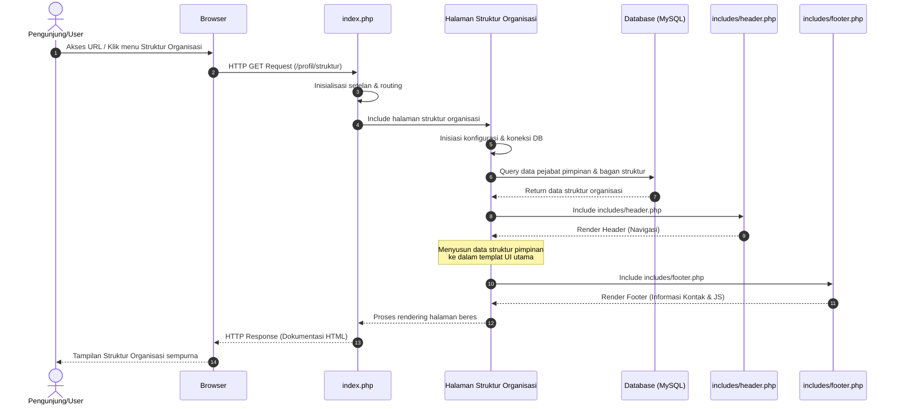

# Sequence Diagram: Halaman Struktur Organisasi

Diagram sekuensial ini memvisualisasikan alur kerja interaksi sistem ketika seorang pengguna mengakses halaman **Struktur Organisasi** fakultas.

## Penjelasan Alur

Diagram sekuensial berikut menjabarkan alur dari halaman struktur organisasi.
1. **Pengguna Meminta Halaman**: Pengunjung mengklik menu struktur organisasi atau mengakses secara langsung via URL di peramban.
2. **Pengaturan Rute (`index.php`)**: Permintaan diterima oleh `index.php` (*router*) yang menginisialisasi konfigurasi awal dan mendistribusikan permintaan ini.
3. **Pemuatan Berkas Tujuan**: Sistem memuat berkas yang secara khusus bertugas menyajikan halaman struktur organisasi.
4. **Persiapan Database**: Berkas halaman struktur organisasi selanjutnya memuat modul pengaturan pangkalan data.
5. **Penarikan Data Struktur**: Halaman ini lalu merumuskan dan mengirim kueri ke basis data untuk mengambil daftar pejabat pimpinan fakultas dan informasi bagan struktur organisasi dari tabel yang bersesuaian.
6. **Pengembalian Data**: Basis data merespons dengan rincian data pejabat/struktur.
7. **Render Header**: Antarmuka bagian paling atas dirangkai menggunakan berkas `includes/header.php` yang meliputi menu utama situs.
8. **Render Konten Utama**: Sistem secara dinamis menempatkan data pimpinan serta elemen gambar abstrak struktur ke dalam templat antarmuka (HTML).
9. **Render Footer**: Tampilan bagian bawah (mencakup elemen terkait hak cipta atau JavaScript pendukung) dirapal melalui `includes/footer.php`.
10. **Respon Akhir**: Tiga bagian tersebut lalu disatukan dan diumpankan baliknya ke peramban dalam bentuk respons dokumen HTML yang sudah dirender sempurna untuk ditilik pengunjung.

## Diagram

