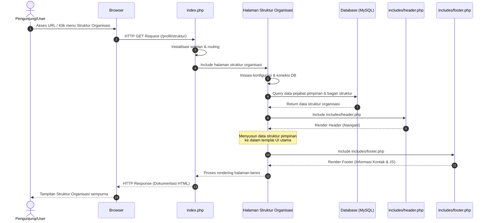

# Sequence Diagram: Halaman Struktur Organisasi

Diagram sekuensial ini memvisualisasikan alur kerja interaksi sistem ketika seorang pengguna mengakses halaman **Struktur Organisasi** fakultas.

## Penjelasan Alur

Rangkaian interaksi skema Struktur Organisasi bermula di titik ketika pengguna mencetuskan kunjungan sistemnya melalui perpindahan navigasi menuju halaman struktur. Layaknya sistem manajemen rute satu pintu, pengelola `index.php` senantiasa mencatat dan mengolah permintaan (*request*) ini supaya dapat menyerahkan wewenang kontrol pemrosesan kepada unit berkas yang secara dedikatif dirancang untuk membacakan struktur organisasi fakultas. Sejak unit ini menerima beban kerja, konfigurasi *framework* dan modul ikatan basis data MySQL pun seketika dibangun guna merembuk kesepakatan penarikan informasi antara *server* dan *database*.

Dengan meluncurkan baris perintah *query select*, sistem lantas membongkar koleksi tabel data untuk mengekstraksi senarai pimpinan pemegang mandat struktural fakultas dan mengambil rincian grafis terkait urutan eselon bagan hierarki tersebut. Bersamaan dengan pangkalan data yang menggulirkan balikan nilai data, sistem membagi kerangka *front-end* dengan menganyam batas navigasi pucuk situs (`includes/header.php`), mengisi badan templat web HTML dengan hasil pementasan daftar bagan pemimpin, serta melampirkan modul pengaya yang ada pada lantai kaki elemen (`includes/footer.php`). Lewat penggabungan tripartit inilah, sebuah arsitektur dokumen web terwujud paripurna lalu dipersembahkan ke arah layar peramban audiens.

## Diagram

