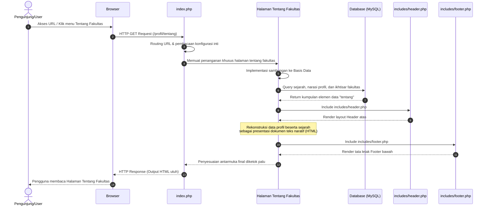

# Sequence Diagram: Halaman Tentang Fakultas

Diagram sekuensial ini merinci alur di dalam sistem tatkala seorang pengguna mencoba melihat halaman informasi detail histori maupun entitas **Tentang Fakultas**.

## Penjelasan Alur

Pemanggilan atas profil naratif "Tentang Fakultas" digerakkan oleh aksi navigasi pengunjung yang bertamu ke halaman profil fakultas. Alur ini otomatis merangsang rekam kueri HTTP dari peramban, yang dengan sigap dipaparkan dan diambil alih posisinya oleh inti situs (`index.php`) selaku pintu pengatur presisi rute. Berkas inti menangguhkan tugas tersebut kepada skrip unit penampil Tentang Fakultas, di mana tahapan berikutnya sangat esensial: memicu panggilan ke titik akses repositori pangkalan data terpusat (MySQL).

Sejenak sesudah sambungan *database* terbentuk mumpuni, sistem mengajukan sintaks perintah permohonan pengambilan rekam jejak histori fakultas, ikhtisar gambaran umum, dan atribut profil esensial lainnya. Luaran (*result set*) teks dari basis data yang sarat memori sejarah itu pun diteruskan lurus ke *backend* peladen. Sementara data disinggahkan, kerangka tatanan kepala bernavigasi situs beserta segenap berkas gaya (`includes/header.php`) dikail, dirakit mengitari pementasan rincian dokumen HTML, sebelum disempurnakan lagi dengan bingkai jejak bawah (*footer*). Sebagai tahap penyegelan fungsional, kumpulan balok-balok susunan komponen layar diumpankan satu arah menjadi kode respons berspesifikasi yang utuh di sisi antarmuka sang pengunjung.

## Diagram

