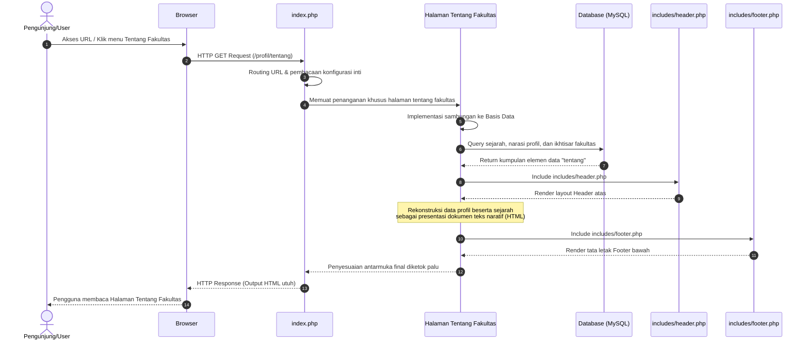

# Sequence Diagram: Halaman Tentang Fakultas

Diagram sekuensial ini merinci alur di dalam sistem tatkala seorang pengguna mencoba melihat halaman informasi detail histori maupun entitas **Tentang Fakultas**.

## Penjelasan Alur

Berikut rincian naratif tahapan pemanggilan atas halaman tentang fakultas:
1. **Interaksi Pengawal**: Pengguna mengunjungi situs dan mengarahkan navigasinya ke tautan "Tentang Fakultas" pada kumpulan menu beranda. 
2. **Pola Pengendalian Rute**: *Web server* melimpahkan permintaan (*request*) tersebut ke skrip peladen utama kita, yaitu berkas `index.php`. Skrip inilah yang menugaskan penanganan awal berdasarkan struktur antarmuka URL.
3. **Delegasi ke Modul Halaman**: Di bawah komando `index.php`, skrip fungsionalitas dari unit "Halaman Tentang Fakultas" dipanggil agar dieksekusi pemrosesannya.
4. **Pembukaan Gerbang Basis Data**: Konfigurasi sambungan instansial ke ruang server basis data (*MySQL*) diresmikan lewat inklusi (*include*) *config database*.
5. **Penggalian Substansi Sejarah**: Sistem menyampaikan kueri pemilahan informasi pada skema basis data dengan tujuan mengambil narasi panjang profil, deskripsi visi sejarah berdirinya, dan/atau citra estetis tentang fakultas.
6. **Basis Data Bersuara**: Basis data menanggapinya dengan mengirimkan luaran set (*result set*) dari profil dekanat/fakultas yang otentik kembali pada berkas peminta tersebut.
7. **Penyanderaan Header**: Tatanan kepala (*Header*) navigasi dan pengaya (*CSS*) dipetik dan dirawikan memakai `includes/header.php`.
8. **Asimilasi Teks Naratif**: Narasi sejarah, potret (*image*), serta pendahuluan (*overview*) dilebur menyatu menempati struktur badan kode (*body html*).
9. **Penjagaan Titik Akhir**: Perangkat `includes/footer.php` ditautkan buat menetapkan bingkai kaki yang paripurna (lengkap dengan hak cipta dan sambungan media sosial).
10. **Penggenapan Halaman**: Susunan padu yang final ini dikemas lalu dilontarkan lewat pintu keluar sebagai tanggapan web kepada pembaca, dengan seutuhnya menayangkan profil rinci mengenai pihak fakultas.

## Diagram

