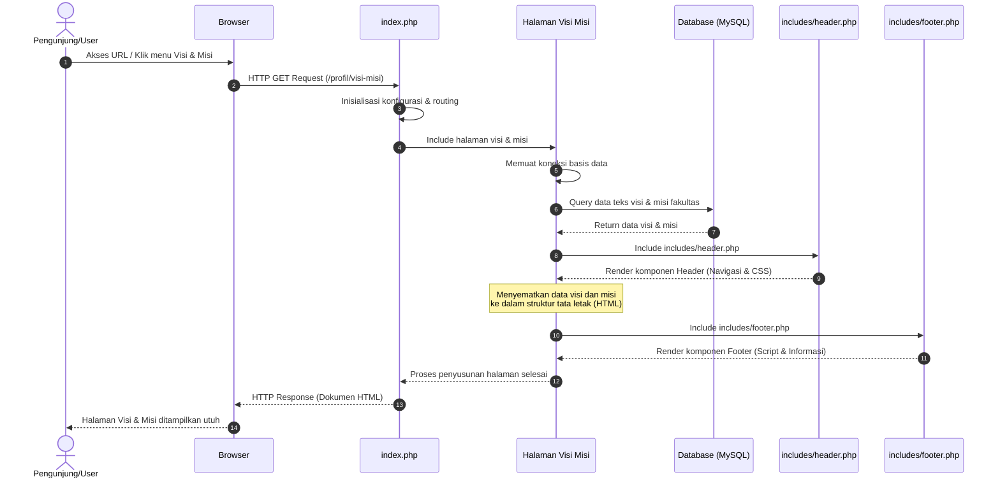

# Sequence Diagram: Halaman Visi dan Misi

Diagram sekuensial ini memvisualisasikan alur kerja sistem ketika seorang pengunjung mengakses halaman **Visi dan Misi** dari Web FIKOM.

## Penjelasan Alur

Diagram sekuensial berikut menjabarkan alur interaksi sistem ketika seorang pengguna mengakses halaman visi dan misi fakultas. 
1. **Pengguna Meminta Halaman**: Pengunjung menginisiasi permintaan melalui peramban (browser) dengan mengklik menu atau mengakses URL halaman visi dan misi.
2. **Routing oleh `index.php`**: Permintaan ini pertama kali diterima oleh berkas `index.php` utama yang berfungsi sebagai pengatur rute (*router*). Berkas ini juga menangani inisialisasi konfigurasi sistem.
3. **Pemuatan Halaman**: Berdasar pada rute yang diminta, `index.php` kemudian memuat dan mengeksekusi berkas khusus untuk halaman visi dan misi.
4. **Koneksi Database**: Berkas halaman visi dan misi tersebut memuat konfigurasi basis data dan menyiapkan koneksi.
5. **Pengambilan Data (Query)**: Sistem mengeksekusi kueri ke basis data untuk menarik teks penjabaran visi dan misi fakultas yang paling mutakhir. Basis data kemudian mengembalikan data teks tersebut.
6. **Render Header**: Sistem menyusun bagian atas tampilan dengan memuat komponen navigasi dan logo melalui berkas `includes/header.php`.
7. **Penyusunan Konten**: Data visi dan misi yang didapat dari basis data disematkan ke dalam kerangka tata letak antarmuka utama berbasis HTML.
8. **Render Footer**: Sistem memuat komponen penutup halaman di bagian bawah, termasuk informasi kontak dan *scripts* esensial melalui `includes/footer.php`.
9. **Respon ke Pengguna**: Seluruh rangkaian komponen (Header, Konten Utama, Footer) digabungkan menjadi sebuah dokumen HTML yang padu dan utuh. Dokumen ini kemudian dikirimkan kembali sebagai respons HTTP ke peramban untuk ditampilkan secara utuh kepada pengguna.

## Diagram

