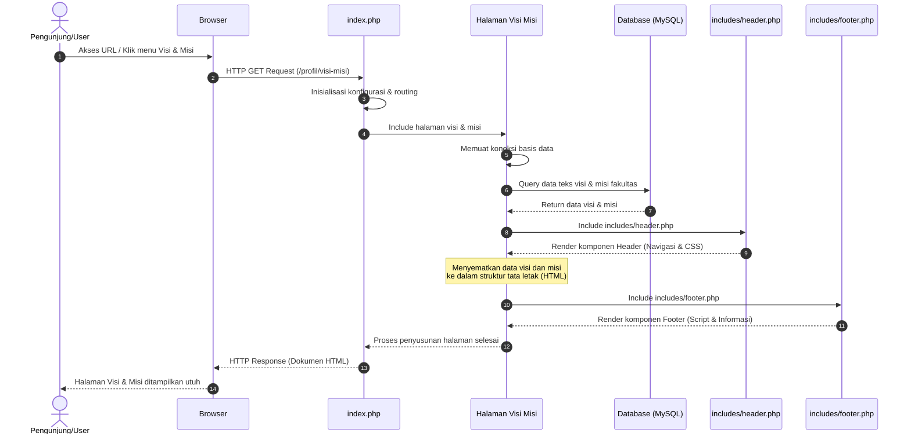

# Sequence Diagram: Halaman Visi dan Misi

Diagram sekuensial ini memvisualisasikan alur kerja sistem ketika seorang pengunjung mengakses halaman **Visi dan Misi** dari Web FIKOM.

## Penjelasan Alur

Alur pergerakan pada tayangan halaman Visi dan Misi mencerminkan sinkronisasi yang berkesinambungan seketika audiens melakukan permintaan akses ke dalam sub-tautan tersebut. Langkah komputasi yang pertama langsung terpusat pada file perutean utama aplikasi (`index.php`), di mana sistem tidak sekadar mengatur konfigurasi mutlak *platform* tetapi juga dengan teliti memahami parameter pemuatan spesifik bagi halaman visi misi. Terbekali oleh jembatan inisialisasi koneksi repositori penyimpanan data fakultas, sistem *backend* lalu mendirikan pilar konektivitas kokoh menuju pangkalan data (MySQL) yang berjalan menopang aplikasi.

Proyeksi atas kueri kemudian dipercayakan untuk merengkuh elemen teks penjabaran visi dan butir misi fakultas paling termutakhir yang bersembunyi dalam tabel basis data. Pangkalan data selanjutnya mendelegasikan balik substansi nilai itu guna ditempatkan teratur ke bilik pementasan antarmuka. Dengan sinkronisasi tata letak yang bersandar pada bingkai hiasan *header* serta batasan informasi kaki (*footer*), skrip-skrip inti tersebut mengkristal menyempurnakan bentuk tanggapan HTML murni. Tahap purwarupa respons tersebut perlahan disuguhkan dan dirilis ke hadapan peramban, meyakinkan bahwa audiens memandang rincian Visi dan Misi secara harmonis.

## Diagram

