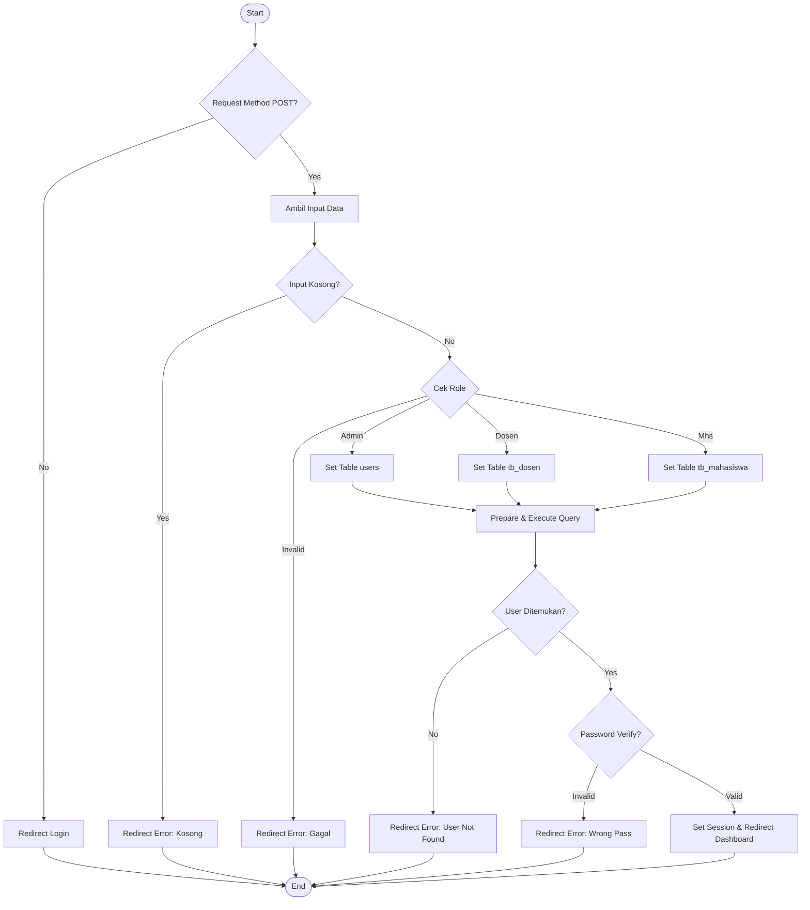
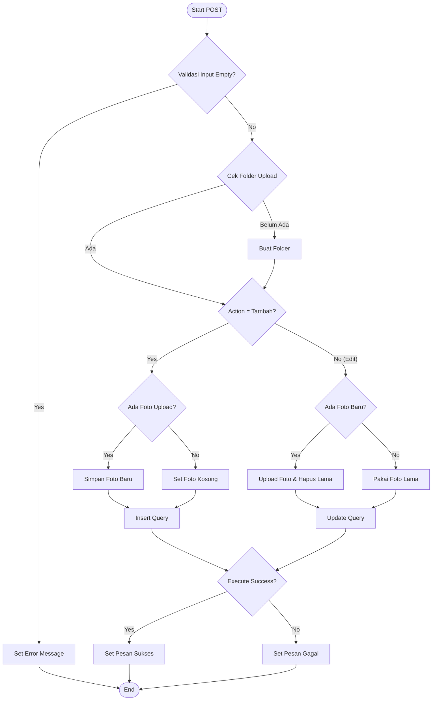
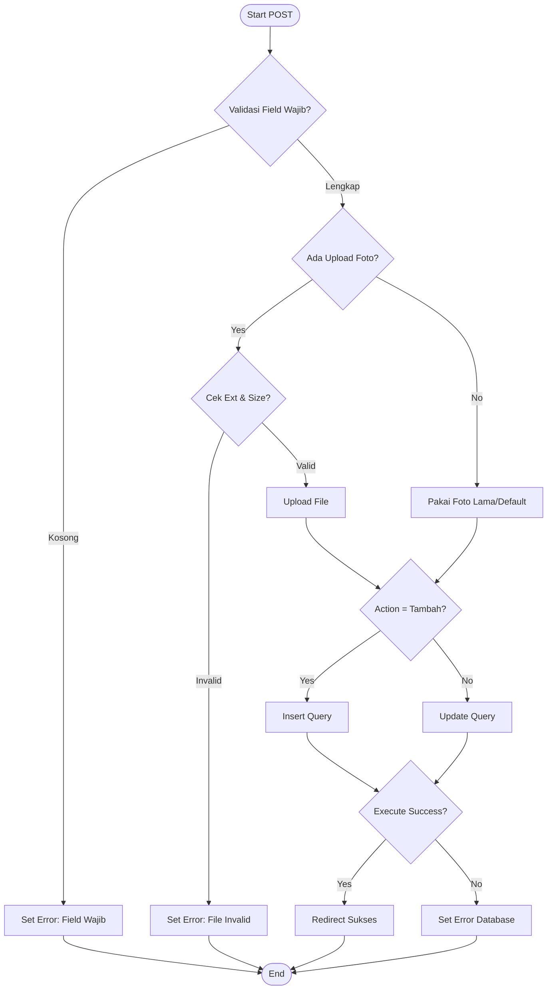
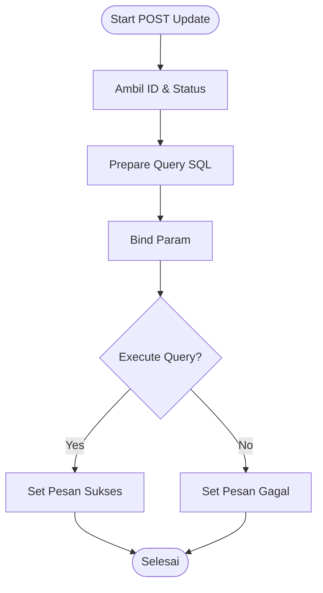

# Pengujian White Box (White Box Testing)

Pengujian White Box berfokus pada analisa struktur logika internal kode program. Pengujian ini menggunakan metode **Basis Path Testing** untuk memastikan setiap jalur logika telah dieksekusi setidaknya satu kali.

---

## 1. Unit Pengujian: Autentikasi Login (`admin/proses_login.php`)

### A. Flowchart Logika

### B. Kompleksitas Siklomatik (Cyclomatic Complexity)
Rumus: `CC = Predicate Nodes + 1`

*   **Predicate Nodes:**
    1.  `if POST`
    2.  `if empty`
    3.  `if role == admin`
    4.  `elseif role == dosen`
    5.  `elseif role == mahasiswa`
    6.  `if num_rows == 1` (User Found)
    7.  `if password_verify`

**Perhitungan:** `CC = 7 + 1 = 8`

### C. Jalur Pengujian (Basis Path)
| Jalur | Kondisi | Hasil |
|-------|---------|-------|
| 1 | Bukan POST | Redirect Login |
| 2 | Input Kosong | Error "Data Kosong" |
| 3 | Role Tidak Valid | Error "Login Gagal" |
| 4 | User Tidak Ditemukan | Error "User Not Found" |
| 5 | Password Salah | Error "Password Salah" |
| 6 | Login Berhasil (Admin) | Masuk Dashboard Admin |
| 7 | Login Berhasil (Dosen) | Masuk Dashboard Dosen |
| 8 | Login Berhasil (Mhs) | Masuk Dashboard Mhs |

---

## 2. Unit Pengujian: Tambah & Edit Berita (`admin/kelola_berita.php`)

### A. Flowchart Logika (Blok POST)

### B. Kompleksitas Siklomatik
*   **Predicate Nodes:**
    1.  `if empty(judul/kategori)`
    2.  `if !is_dir`
    3.  `if action == tambah`
    4.  `if !empty(files)` (pada blok Tambah)
    5.  `if !empty(files)` (pada blok Edit)
    6.  `if execute`

**Perhitungan:** `CC = 6 + 1 = 7`

### C. Jalur Pengujian
| Jalur | Deskripsi | Hasil Harapan |
|-------|-----------|---------------|
| 1 | Input Kosong | Pesan Error Validasi |
| 2 | Tambah + Foto Ada + Sukses | Data Masuk & Foto Terupload |
| 3 | Tambah + Tanpa Foto + Sukses | Data Masuk (Foto Null) |
| 4 | Edit + Ganti Foto + Sukses | Data Update & Foto Lama Terhapus |
| 5 | Edit + Tanpa Ganti Foto | Data Update (Foto Tetap) |
| 6 | Query Gagal | Pesan Error Database |

---

## 3. Unit Pengujian: Kelola Dosen (`admin/kelola_dosen.php`)

### A. Flowchart Logika (Blok POST & Validasi File)

### B. Kompleksitas Siklomatik
*   **Predicate Nodes:**
    1.  `if empty(input)`
    2.  `if isset(files)`
    3.  `if ext_valid && size_valid`
    4.  `if action == tambah`
    5.  `if execute`

**Perhitungan:** `CC = 5 + 1 = 6`

### C. Jalur Pengujian
| Jalur | Deskripsi | Hasil Harapan |
|-------|-----------|---------------|
| 1 | Input Wajib Kosong | Error Validasi Field |
| 2 | Upload File Salah (PDF/Exe) | Error Validasi File |
| 3 | Tambah Dosen Valid | Redirect Sukses |
| 4 | Edit Dosen Valid | Redirect Sukses |
| 5 | Query Gagal | Error Database |

---

## 4. Unit Pengujian: Update Status Pendaftaran (`admin/kelola_pendaftaran.php`)

### A. Flowchart Logika (Update Status)

### B. Kompleksitas Siklomatik
*   **Predicate Nodes:**
    1.  `if execute`

**Perhitungan:** `CC = 1 + 1 = 2`

### C. Jalur Pengujian
| Jalur | Deskripsi | Hasil Harapan |
|-------|-----------|---------------|
| 1 | Update Berhasil | Pesan Sukses Muncul |
| 2 | Update Gagal (DB Error) | Pesan Error Muncul |

---

## Kesimpulan
Pengujian White Box telah dilakukan pada 4 modul krusial. Hasil perhitungan **Cyclomatic Complexity** menunjukkan angka rata-rata di bawah 10 (Login=8, Berita=7, Dosen=6, Pendaftaran=2), yang mengindikasikan bahwa struktur logika kode program **efisien, tidak terlalu kompleks, dan mudah untuk dipelihara (maintainable)**.
