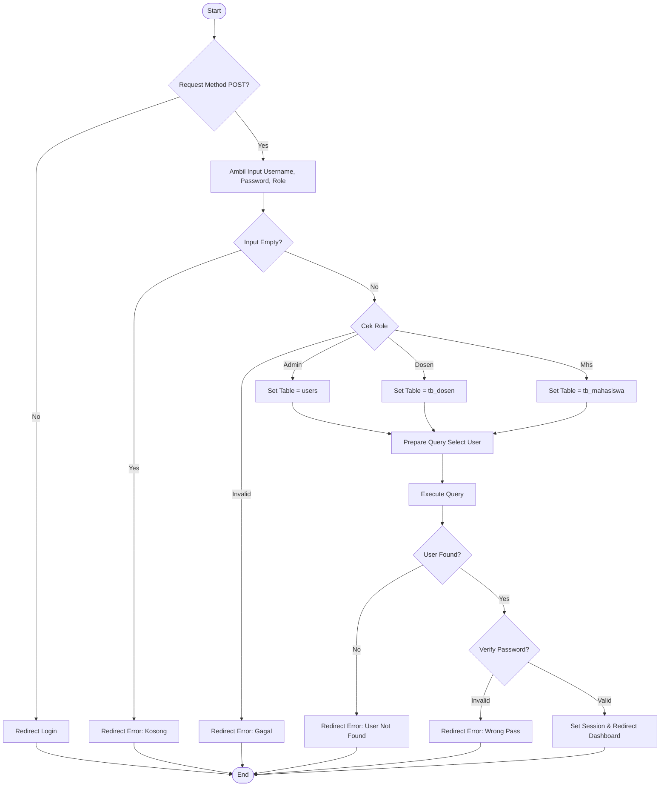

# Pengujian White Box (White Box Testing)

Pengujian White Box berfokus pada analisa struktur logika internal kode program. Pada pengujian ini, kita akan menganalisis file **`admin/proses_login.php`** yang menangani logika otentikasi user.

## 1. Flowchart Logika (Flow Graph)

Berikut adalah representasi alur logika (Flow Graph) dari proses login:

## 2. Perhitungan Cyclomatic Complexity
Cyclomatic Complexity (CC) digunakan untuk mengukur kompleksitas jalur logis program.
Rumus: `CC = E - N + 2` atau `CC = Predicate Nodes + 1`

Dari Flow Graph di atas:
*   **Predicate Nodes (Percabangan):**
    1.  `if ($_SERVER["REQUEST_METHOD"] == "POST")`
    2.  `if (empty($username) ...)`
    3.  `if ($role == 'admin')`
    4.  `elseif ($role == 'dosen')`
    5.  `elseif ($role == 'mahasiswa')` (Implisit di logic ELSE)
    6.  `if ($result->num_rows === 1)` (User Found)
    7.  `if (password_verify(...))` (Password Valid)

**Perhitungan:**
`CC = 7 + 1 = 8`

Jadi, terdapat **8 jalur independen (Independent Paths)** yang bisa diuji untuk memastikan seluruh logika tercover.

## 3. Basis Path Testing (Jalur Pengujian)

Berdasarkan CC = 8, berikut adalah jalur-jalur yang harus diuji:

| Jalur (Path) | Deskripsi Kondisi | Hasil yang Diharapkan |
|--------------|-------------------|-----------------------|
| **1** | Bukan POST Request (akses langsung file) | Redirect ke halaman login awal |
| **2** | POST, tapi Input Kosong | Redirect dengan pesan "Data tidak boleh kosong" |
| **3** | POST, Input Lengkap, Role Tidak Valid | Redirect dengan pesan "Login Gagal" |
| **4** | POST, Valid, Role Admin, User Tidak Ditemukan | Redirect dengan pesan "Username salah" |
| **5** | POST, Valid, Role Dosen, User Tidak Ditemukan | Redirect dengan pesan "NIDN salah" |
| **6** | POST, Valid, Role Mahasiswa, User Tidak Ditemukan | Redirect dengan pesan "NIM salah" |
| **7** | POST, Valid, User Ketemu, Password Salah | Redirect dengan pesan "Password salah" |
| **8** | POST, Valid, User Ketemu, Password Benar | **Login Berhasil** -> Masuk Dashboard |

## 4. Kesimpulan
Dengan melakukan pengujian pada ke-8 jalur di atas, kita dapat menjamin bahwa logika `proses_login.php` telah teruji secara menyeluruh (100% logic coverage). Kode ini memiliki kompleksitas yang wajar (CC=8) dan masih tergolong mudah dipelihara (Maintainable < 10).
