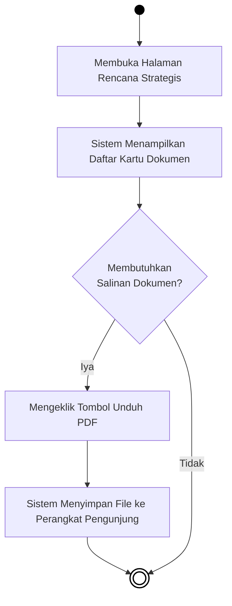
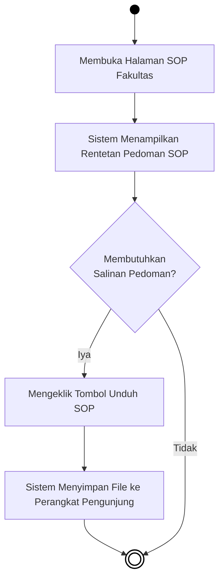
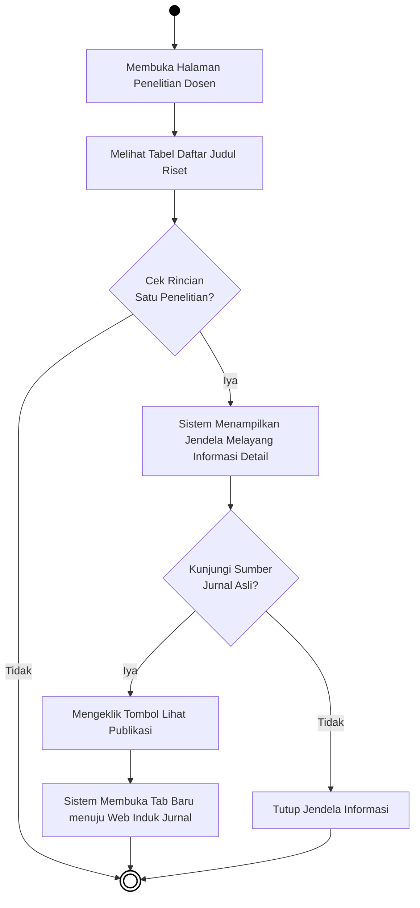
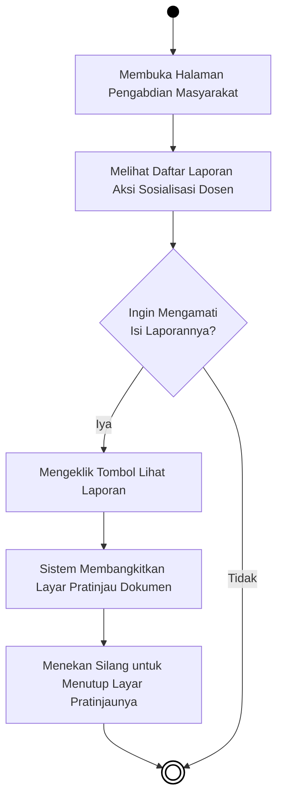
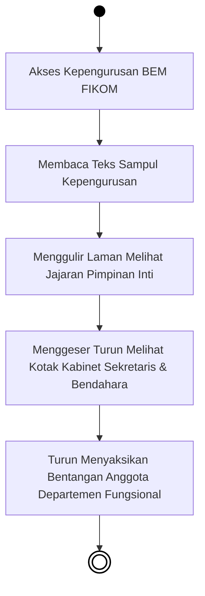

---

### 4.3.13 Activity Diagram Menu Rencana Operasional (Renop)

***Gambar 4.34** Activity Diagram Menu Rencana Operasional*

**Penjelasan:**  
Pengunjung yang masuk ke halaman ini langsung disuguhkan rincian dokumen pedoman fakultas yang spesifik pada operasional. Proses keputusannya bertumpu pada apakah pengunjung ingin murni membaca sekelebatan atau bertekat mengunduh salinan berkas fisiknya, di mana ketukan pada tautan unduhan akan memicu sistem merespon dengan menyimpan berkas PDF langsung ke perangkat pembacanya.

---

### 4.3.14 Activity Diagram Menu Rencana Strategis (Renstra)

***Gambar 4.35** Activity Diagram Menu Rencana Strategis*

**Penjelasan:**  
Menirukan arsitektur sistem pada diagram Renop, menu Rencana Strategis membentangkan koleksi berkas pedoman jangka panjang. Alurnya sangat ringkas untuk memonitor kotak-kotak daftarnya dan memutuskan eksekusi proses pengunduhan (*Download*) seandainya pengguna memerlukan arsip dokumen aslinya.

---

### 4.3.15 Activity Diagram Menu Standar Operasional Prosedur (SOP)

***Gambar 4.36** Activity Diagram Menu SOP*

**Penjelasan:**  
Halaman Standar Operasional menjejaki skema interaksi perwujudan berkas digital. Pengunjung bisa berselancar bebas membaca gambaran singkat pelaksanaannya. Jika berniat mendalami ketentuan kerjanya secara paripurna, sistem akan menghantarkan perpindahan fail salinannya lewat satu pijatan khusus pada pemicu unduhannya menuju lumbung muatan gawai (*Download Folder*).

---

### 4.3.16 Activity Diagram Menu Penelitian Dosen

***Gambar 4.37** Activity Diagram Menu Penelitian Dosen*

**Penjelasan:**  
Aktivitas di ruang publikasi riset dirancang sedemikian interaktif. Mengingat muatan riwayatnya yang padat, penelusuran berawal santai sekadar melihat bingkai judul. Bila disinggung kursornya lantas ditekan, panel penengadah *(Popup Layer)* barulah membentangkan informasi penyandang dana berserta statusnya. Peran krusial interaksinya adalah memerdekakan pemakai menyeberang mandiri ke bilik ranah jurnal asli lewat sambungan tembus (*Link Redirect*) antar tab peramban perantaranya.

---

### 4.3.17 Activity Diagram Menu Pengabdian Masyarakat

***Gambar 4.38** Activity Diagram Menu Pengabdian Masyarakat*

**Penjelasan:**  
Pada seksi catatan karya sosialisasi masyarakat, antarmuka peninjau *(Document Viewer)* diarusutamakan untuk meluputkan paksaan pengunduhan sisa tumpukan fail tak perlu. Saat kehendak menyela mengintip laporan timbul, sistem membikin gelap buram belakang halaman sekadar membentangkan perwajahan bacaannya dan sirna saat dicopot.

---

### 4.3.18 Activity Diagram Menu Badan Eksekutif Mahasiswa (BEM)

***Gambar 4.39** Activity Diagram Menu Badan Eksekutif Mahasiswa (BEM)*

**Penjelasan:**  
Bagian administrasi organisasi intra-kampus ini ditutup lewat rutinitas navigasional kaku murni ke bawah *(waterfall)*. Kerangka dirajut menguntai selaras tata letak struktur berjenjang kemahasiswaan. Tapak penjelajahan cukup dipetakan mengikut seretan usapan layar meluncur dari puncak kepemimpinan presidium berangsur sampai lapis anggota-anggota akar kepengurusannya.
